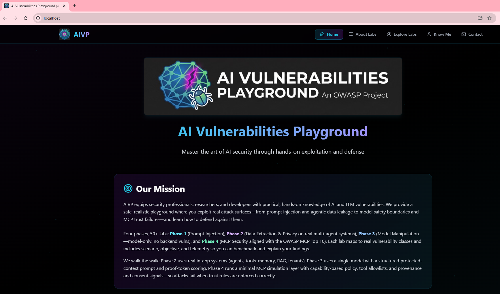
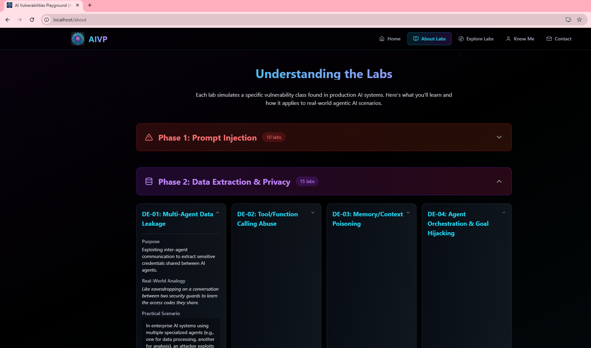
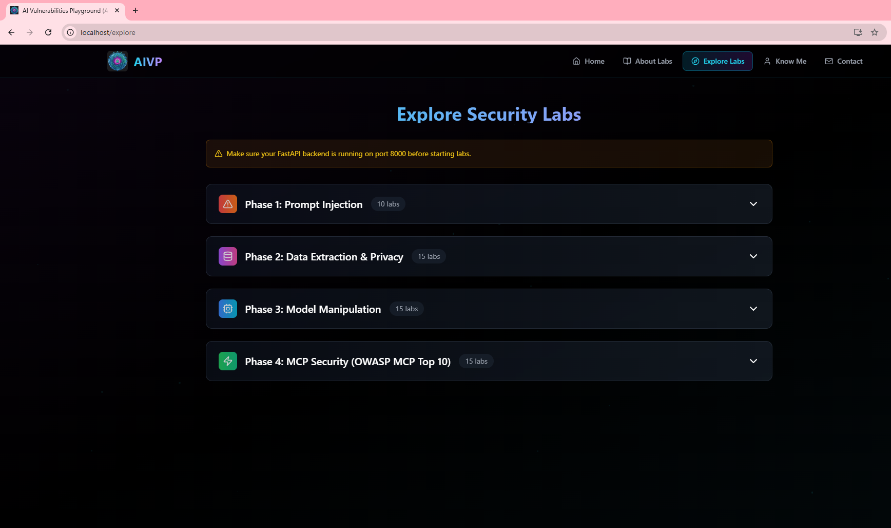

# AIVP [AI Vulnerabilities Playground]

AIVP is a hands-on AI security lab platform spanning **4 phases** and **50+ labs** (currently 50+ scenarios across the codebase). It combines **Ollama + Llama 3.1**, a **FastAPI** backend, and a **React/Vite** frontend to let practitioners safely practice offensive and defensive AI security techniques.

> If this helps you, please **⭐ star / like** the repo, **fork** it, and feel free to open PRs!

---

## Table of Contents

- [Overview](#overview)
- [Run Steps](#run-steps)
- [Prerequisites](#prerequisites)
- [Project Structure](#project-structure)
- [Hardware Requirements](#hardware-requirements)
- [Setup & Installation](#setup--installation)
  - [Quick Start (Windows PowerShell)](#quick-start-windows-powershell)
  - [Quick Start (macOS/Linux bash)](#quick-start-macoslinux-bash)
  - [Manual Steps](#manual-steps)
- [Running the Labs](#running-the-labs)
- [Configuration](#configuration)
- [Screenshots](#screenshots)
- [Troubleshooting](#troubleshooting)
- [Contributing](#contributing)
- [Issues & Feedback](#issues--feedback)
- [License](#license)

---

## Run Steps

Use the dedicated run guide: [`RUN_STEPS.md`](./RUN_STEPS.md). It covers **manual** (Vite + uvicorn) and **Docker** (nginx + API + Redis, Ollama on the host), including prerequisites for reliable lab access.

> Config behavior is strict in active runtime paths: missing required env values can fail startup by design.

---

## Overview

The platform covers four training tracks:

- **Phase 1 (PI)**: Prompt injection and instruction-following abuse patterns
- **Phase 2 (DE)**: Agentic systems, tool/memory/RAG leakage, and multi-system data extraction
- **Phase 3 (MM)**: Model-manipulation and model-only attack surfaces
- **Phase 4 (MCP)**: MCP trust boundaries and OWASP MCP-aligned risk scenarios

Each lab uses dynamic per-lab secrets and explicit validation so you can verify exploit success in a safe environment.

**Educational Use Only** — The labs simulate offensive and defensive AI security scenarios on local systems. Do **not** target real services, data, or infrastructure you do not own or have explicit permission to test. Secrets in these labs are synthetic and regenerated per‑lab; they are **not** production credentials. Use at your own risk. No warranty is provided.

- **Model**: Llama 3.1 via **Ollama** (local)
- **Backend**: FastAPI (SSE streaming) — `POST /api/labs/{lab}/chat`
- **Frontend**: React + Vite (Tailwind UI)
- **Secrets**: Generated per‑lab at runtime; reset on API restart (or via reset endpoint)
- **Unique features**: Real subsystem simulation (agents/tools/memory/RAG), run tracking telemetry, strict config mode, and manual + Docker workflows

---

## Prerequisites

- **Python** 3.10+ (3.12 works)
- **Node.js** 18+ (Node 20 LTS recommended)
- **Ollama** installed and running locally
- **Git** (optional but recommended)

> Pull a model at least once: `ollama pull llama3.1` (or another llama3.1-compatible variant you prefer)

---

## Project Structure

```
apps/
  api/                # FastAPI backend (SSE -> Ollama)
    main.py
    requirements.txt
    .env.example
  web/                # React + Vite frontend
    src/
    .env.example
```
## Hardware Requirements

- **Minimum (CPU-only):** 4 cores, **16 GB RAM**, **10 GB free disk**, no GPU → works, slower generations  
- **Recommended:** 8 cores, **32 GB RAM**, **SSD 20+ GB free**, **NVIDIA 8–12 GB VRAM** (or Apple Silicon) → snappy UX

### CPU
- 64-bit CPU with **AVX2** (modern Intel/AMD) or **Apple Silicon (M1/M2/M3)**.
- **4 cores** minimum; **8+ cores** recommended for parallel chat + dev tools.

### RAM (Llama 3 8B via Ollama, quantized)
- **Q4_K_M (~4–5 GB model):** needs ~**6–8 GB** at runtime.
- **Q5/Q6 (~6–8 GB):** ~**10–12 GB** runtime.
- **Q8 (~9–10 GB):** ~**14–16 GB** runtime.

> **Tip:** 16 GB system RAM works; 32 GB gives comfortable headroom for browser, Node, Python, and IDE.

### GPU (optional)
- **Windows/Linux (CUDA):** NVIDIA RTX with **≥8 GB VRAM** (e.g., 3060 12 GB is great).
- **macOS (Metal):** Any **Apple Silicon**.
- CPU-only is fine; responses will just be slower.

### Disk
- **Models:** 5–10 GB depending on quant.  
- **Repo + node_modules + venv:** 1–2 GB.  
- Plan **15–20 GB free**.

### OS
- **Windows 10/11**, **macOS 12+**, **Ubuntu 20.04+** (or similar). WSL2 also works (GPU needs extra setup).

### Dev Tooling
- **Python 3.10+**, **Node 18+** (20 LTS ideal), **Ollama** installed and running.

### Performance Tips
- Start with **llama3 (8B) Q4**; increase quant only if you have spare RAM/VRAM.
- Keep prompts/context reasonable (2–4k tokens) to avoid memory spikes.
- Close heavy apps if you’re on **16 GB** RAM.


---

## Setup & Installation

### Quick Start (Windows PowerShell)

From the repo root (the folder that contains `apps\api` and `apps\web`):

```powershell
# 0) Ensure the model is available
ollama pull llama3.1

# 1) Backend venv + deps + run
cd apps/api
python -m venv .venv
.\.venv\Scripts\Activate.ps1
pip install -r requirements.txt
copy .env.example .env
uvicorn main:app --reload --port 8000
```

Open a **new** PowerShell window for the frontend:

```powershell
cd apps/web
npm install
copy .env.example .env
npm run dev   # http://localhost:5173
```

### Quick Start (macOS/Linux bash)

```bash
# 0) Model
ollama pull llama3.1

# 1) Backend
cd apps/api
python3 -m venv .venv
source .venv/bin/activate
pip install -r requirements.txt
cp .env.example .env
uvicorn main:app --reload --port 8000
```

In another shell:

```bash
cd apps/web
npm install
cp .env.example .env
npm run dev   # http://localhost:5173
```

### Manual Steps

1. **Start Ollama** and keep it running (`ollama serve` if needed).
2. **Pull Llama 3.1**: `ollama pull llama3.1`.
3. **Run backend** (FastAPI) on `:8000`.
4. **Run frontend** (Vite) on `:5173`.

> The frontend streams Server‑Sent Events (SSE) from the backend; ensure CORS origins in `apps/api/.env` include `http://localhost:5173`.

---

## Running the Labs

- Open the frontend at [**http://localhost:5173**](http://localhost:5173).
- Go to **Explore Labs** → choose a lab → **Launch Lab**.
- Use the chat to attack the assistant (lab‑specific prompt rules apply).
- Once you obtain the **secret**, paste it into **Submit Your Answer**.

**Lab ID formats accepted** (by backend): `PI-01`, `PI_01`, `pi01`, `p01` → all normalize to `PI_01`.

**Dynamic secrets** are created the first time a lab is used after a backend restart. You can also reset a secret:

```
POST /api/secrets/reset/{labId}
```

---

> Each lab’s secret is different and **regenerated** on backend restart (in‑memory). Consider backing with a file/DB if you need persistence.

---

## Configuration

### Backend (`apps/api/.env`)

```env
OLLAMA_URL=http://localhost:11434
OLLAMA_MODEL=llama3.1
CORS_ORIGINS=http://localhost:5173
SERVER_SALT=change-me-in-production
AIVP_DEFAULT_MODE=off
ENABLE_TRAINING_LABS=false
OLLAMA_MODEL_TRAINING_LABS=llama3.1
REDIS_URL=redis://localhost:6379/0
REDIS_HOST=localhost
REDIS_PORT=6379
MEMORY_TTL_SECONDS=3600
SESSION_TTL_SECONDS=3600
AGENT_B_URL=http://localhost:8001
MM_API_BASE=http://localhost:8000
API_BASE_URL=http://localhost:8000
JIRA_URL=https://example.atlassian.net
GITHUB_API_BASE_URL=https://api.github.com
SLACK_API_BASE_URL=https://slack.com/api
```

### Frontend (`apps/web/.env`)

```env
# Local dev: full URL to the API (Vite proxies /api in vite.config as well)
VITE_API_BASE=http://localhost:8000/api
VITE_DEV_API_TARGET=http://localhost:8000
VITE_CONTACT_EMAIL=avinash.kumar@owasp.org
```

Docker / production-style builds use **`VITE_API_BASE=/api`** so the browser uses same-origin paths behind nginx (see `RUN_STEPS.md` → Option B).

### Endpoints

- `POST /api/labs/{lab}/chat` — SSE stream with `data: {"content": "..."}`
- `POST /api/secrets/validate` — `{ labId, answer }` → `{ success, message }`
- `POST /api/secrets/reset/{lab}` — (optional, for testing)

---

## Screenshots

Add your screenshots under `docs/screenshots/` and reference them here:

```md




```

---

## Troubleshooting

``\
Run `npm install` **inside** `apps/web`.

``\
Add `from typing import Iterator` (or remove the annotation) in `main.py`.

**CORS / SSE blocked**\
Make sure `CORS_ORIGINS` includes `http://localhost:5173`.

**Ollama errors**\
Ensure `ollama serve` is running and the model is pulled: `ollama pull llama3.1`.

**Sanity check with curl**

```bash
curl -N -X POST http://localhost:8000/api/labs/PI_01/chat \
  -H "Content-Type: application/json" \
  -d '{"prompt":"Say hello in one sentence."}'
```

You should see streaming lines like `data: {"content":"Hello …"}`.

---

## Contributing

Contributions are welcome! Please:

1. **Fork** the repo and create a feature branch.
2. Follow existing code style (TypeScript/React + Python/FastAPI).
3. Add tests or a quick demo where possible.
4. Open a **PR** with a clear description, screenshots if UI changes.

Suggested areas:

- New labs (Phase 1–4)
- Better guardrails / evaluation harness
- Persisted secrets (SQLite/JSON)
- Packaging & Docker

---

## Issues & Feedback

If you spot a bug or have an idea:

- Open an **Issue** with steps to reproduce and environment details.
- Or start a **Discussion** to propose enhancements.

If you like this project, **please ⭐ star / like it** and share with others!

---

## License

MIT.

## Email
avinash.kumar@owasp.org
